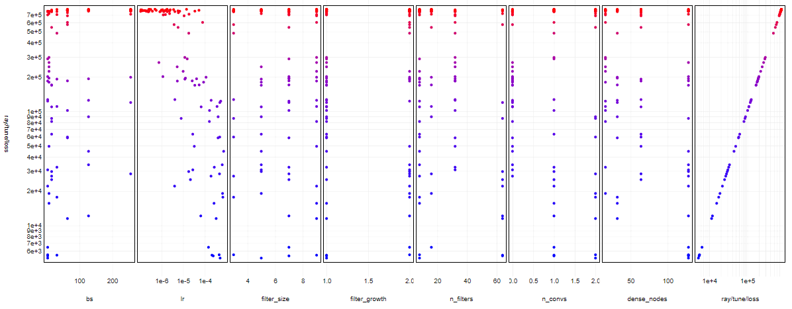

<h1 align="center">Hi there, I'm Simon!</h1>

  

🌞 By day, I'm an ML Engineer, working on modelling and deployment infrastructure.\
🌚 By night, I make random things for fun.

Some things I enjoy working on/with:

* Sourcing and analysing data
* Data exploration and visualization
* Statistics
* Machine learning

## 🔗 Links

* 📫 Email: simonho.ubc@gmail.com
* 📝 Blog: [https://www.simonho.ca/posts](https://www.simonho.ca/posts)
* 📄 Resume: [https://www.simonho.ca/resume](https://www.simonho.ca/resume/)
* 🔷 LinkedIn: [https://linkedin.com/in/simon-ho](https://linkedin.com/in/simon-ho)
* 🔶 Stack Overflow: [https://stackoverflow.com/users/2605604](https://stackoverflow.com/users/2605604)

## ✍️ Recent Blog Posts 
<!-- BLOG-POST-LIST:START -->
- [Webcam Eye Tracker: Eye Tracking Video Games](https://www.simonho.ca/machine-learning/webcam-eye-tracker-video-games/)
- [Webcam Eye Tracker: Deep Learning with PyTorch](https://www.simonho.ca/machine-learning/webcam-eye-tracker-deep-learning-with-pytorch/)
- [Webcam Eye Tracker: Data Collection of Screen Coordinates](https://www.simonho.ca/machine-learning/webcam-eye-tracker-data-collection/)
- [Webcam Eye Tracker: Webcam Features and Face Detection](https://www.simonho.ca/machine-learning/webcam-eye-tracker-face-detection/)
- [Webcam Eye Tracker: An End-to-end Deep Learning Project](https://www.simonho.ca/machine-learning/webcam-eye-tracker-overview/)
<!-- BLOG-POST-LIST:END -->

## 🛠 Technologies

### Languages

### ML / DL

### Infrastructure

### Databases

